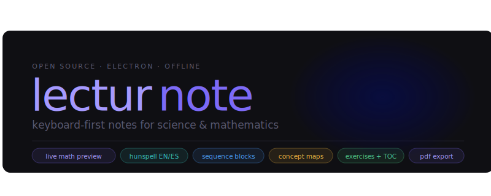

# lecturnote — Beta 1.0

Keyboard-first lecture notes editor for Computational Biology, Bioinformatics, and Mathematics.
Built with Electron — runs as a native desktop app, fully offline, no server required.

**Notes are stored in Electron's localStorage** (`~/.config/lecturnote/` on Linux, `~/Library/Application Support/lecturnote/` on macOS) — they never touch the project files and will not be uploaded to Git.

For full syntax reference and customisation guide, see [documentation.md](documentation.md).

---

## Setup

Requires **Node.js LTS** — https://nodejs.org

```bash
git clone https://github.com/leumas305/lecturnote
cd lecturnote-app
npm install
npm start
```

### Build a distributable app

```bash
npm run build-mac     # macOS  → dist/*.dmg
npm run build-win     # Windows → dist/*.exe
npm run build-linux   # Linux  → dist/*.AppImage
```

---

## File structure

```
lecturnote-app/
├── index.html          # Full app UI — edit this to customise commands/snippets
├── main.js             # Electron main process
├── preload.js          # Loads Hunspell spellchecker via Node, exposes to renderer
├── package.json        # Dependencies: electron, electron-builder, nspell
├── dict/
│   ├── en.aff          # Hunspell English affix rules
│   ├── en.dic          # Hunspell English dictionary (~49k words)
│   ├── es.aff          # Hunspell Spanish affix rules
│   └── es.dic          # Hunspell Spanish dictionary (~57k words)
└── README.md
```

---

## Keyboard shortcuts

All shortcuts are remappable via **Ctrl+,** (settings panel).
You can change the key and the modifier family (Ctrl+Alt / Ctrl / Ctrl+Shift) per action.

### Navigation & UI
| Shortcut | Action |
|----------|--------|
| Ctrl+G | Section jump palette |
| Ctrl+Alt+O | Toggle notes sidebar |
| Ctrl+Alt+Z | Toggle scratchpad (not saved) |
| Ctrl+, | Shortcuts settings |

### Formatting
| Shortcut | Action |
|----------|--------|
| Ctrl+B | Bold |
| Ctrl+I | Italic |
| Ctrl+\` | Inline code |
| `(` `[` `{` | Auto-close pair; typing the closing char jumps over it |

### Colored boxes
| Shortcut | Box |
|----------|-----|
| Ctrl+Alt+E | Example (blue) |
| Ctrl+Alt+D | Definition (green) |
| Ctrl+Alt+W | Theorem (purple) |
| Ctrl+Alt+P | Proof (teal) |
| Ctrl+Alt+N | Note (pink) |
| Ctrl+Alt+R | Remark (grey) |
| Ctrl+Alt+! | Warning (amber) |
| Ctrl+Alt+Q | Sequence block (DNA / RNA / AA) |
| Ctrl+Alt+X | Exercise block (with solution toggle) |
| Ctrl+Alt+B | Box picker menu |

### Tables
| Shortcut | Action |
|----------|--------|
| Ctrl+Alt+Y | Open visual table editor |
| Tab / Shift+Tab | Navigate between cells |
| ↑ ↓ ← → | Navigate between cells |
| Ctrl++ | Add row |
| Ctrl+- | Remove last row |
| Ctrl+Shift++ | Add column |
| Ctrl+Shift+- | Remove last column |
| Enter | Confirm and insert |
| Esc | Cancel |

### Code blocks
| Shortcut | Action |
|----------|--------|
| Ctrl+Alt+J | Code language picker |

Language keys: **P** Python · **J** JavaScript · **T** TypeScript · **R** Rust · **C** C++ · **M** Matlab · **L** LaTeX · **B** Bash · **H** HTML · **S** SQL

### Other
| Shortcut | Action |
|----------|--------|
| Ctrl+Alt+K | Internal anchor picker |
| Type `[[#` | Inline anchor autocomplete |
| Ctrl+Alt+Space | Timestamp [HH:MM] |
| Ctrl+Alt+M | New note |
| Ctrl+S | Save |
| Ctrl+Shift+S | Export to PDF |

---

## Feedback

Found a bug or have a suggestion? Open an issue at:
**https://github.com/leumas305/lecturnote/issues**

---

## Future work

- **BK-tree** — real-time lookup against larger custom dictionaries
- **Note export/import** — backup all notes to `.json` and restore
- **Inter-note links** — `[[note:Title]]` to link between different notes
